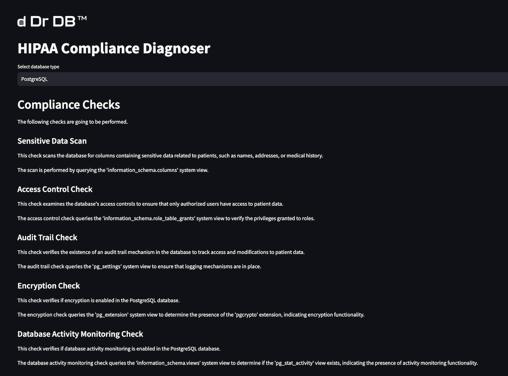

# HIPAA Compliance Diagnoser

[](https://github.com/DrDB-ai/HIPAA-Compliance-Diagnoser/actions/workflows/test-and-build-container.yml)

This repository contains code for diagnosing HIPAA compliance for different database management systems (DBMS).

The application itself runs on Streamlit and connects to each DBMS and runs a suite of queries to check for HIPAA compliance.



## Supported Databases

The HIPAA compliance checks are implemented for the following database management systems:

- PostgreSQL
- MySQL
- Microsoft SQL Server
- IBM Db2
- Oracle Database

For every database you need to enter the hostname, port, database name, username, and password.

## HIPAA Compliance Checks

### Sensitive Data Scan

This check scans the database for columns containing sensitive data related to patients, such as names, addresses, or medical history.

### Access Control Check

This check examines the database's access controls to ensure that only authorized users have access to patient data.

### Audit Trail Check

This check verifies the existence of an audit trail mechanism in the database to track access and modifications to patient data.

### Encryption Check

This check verifies if encryption is enabled in the database to protect patient data at rest.

### Database Activity Monitoring Check

This check verifies if database activity monitoring is enabled to detect unauthorized access or suspicious activities related to patient data.

Details for DBMS specific checks can be accessed in the application.

## Installation

To run the HIPAA compliance checks, you'll need to have Python 3.9+ installed on your system. Clone this repository to your local machine and run:

```bash
git clone https://github.com/DrDB-ai/HIPAA-Compliance-Diagnoser.git
pip install -r requirements.txt
python src/app.py
```

For Oracle and SQL Server, you also need to install native drivers on your machine. Please check the Dockerfile for reference.

## Docker

### Build

```
docker build --platform=linux/amd64  -t hipaa-compliance-diagnoser .
```

### Run

```
docker run --platform=linux/amd64 -p 8501:8501 hipaa-compliance-diagnoser
```

## Deployment

[Instructions on deploying to AWS, GCP, and Azure](./DEPLOY.md)

## Contributing

Contributions are welcome! If you'd like to add additional HIPAA compliance checks or improve existing ones or add support for more databases, feel free to fork this repository, make your changes, and submit a pull request.

## Disclaimer

This tool serves as a reference for assisting in HIPAA compliance efforts within databases. While it provides valuable insights and checks, it may not cover all aspects of HIPAA compliance, and relying solely on this tool is not recommended. Organizations should conduct thorough assessments and consult with legal and compliance experts to ensure comprehensive compliance with HIPAA regulations. This tool should be treated as a supportive resource rather than a definitive measure of compliance.